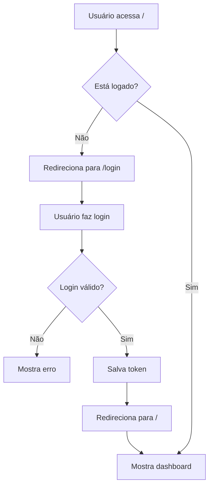

# 👤 Módulo de Usuários - TripControl

## 🎯 Funcionalidades Implementadas

### ✅ Sistema de Autenticação Completo
- **Login/Logout** com JWT
- **Proteção de rotas** automática
- **Persistência de sessão** no localStorage
- **Redirecionamento** automático para login

### ✅ Gerenciamento de Usuários
- **CRUD completo** de usuários
- **Perfis de acesso** (ADMIN, MANAGER, USER)
- **Status de usuário** (ACTIVE, INACTIVE, SUSPENDED)
- **Validação de dados** e tratamento de erros

### ✅ Interface Moderna
- **Página de login** responsiva e moderna
- **Dashboard** com informações do usuário
- **Menu de navegação** com logout
- **Modais** para criação/edição

## 🔐 Credenciais de Acesso

### Usuário Administrador Padrão
```
Usuário: admin
Senha: admin
Email: admin@tripcontrol.com
Perfil: Administrador
```

## 🏗️ Estrutura Técnica

### 📁 Arquivos Criados/Modificados

#### **Backend (API Routes)**
- `src/app/api/auth/login/route.ts` - Autenticação
- `src/app/api/users/route.ts` - CRUD de usuários
- `src/app/api/users/[id]/route.ts` - Operações específicas

#### **Frontend (Páginas e Componentes)**
- `src/app/login/page.tsx` - Página de login
- `src/app/users/page.tsx` - Gerenciamento de usuários
- `src/contexts/AuthContext.tsx` - Contexto de autenticação
- `src/components/Layout.tsx` - Layout com proteção de rotas

#### **Banco de Dados**
- `prisma/schema.prisma` - Modelo User e relacionamentos
- `prisma/migrations/20250810144115_add_users/` - Migração do banco

#### **Scripts**
- `scripts/seed.js` - Dados iniciais com usuário admin

### 🔧 Tecnologias Utilizadas

#### **Autenticação**
- **bcryptjs** - Hash de senhas
- **jsonwebtoken** - Tokens JWT
- **localStorage** - Persistência de sessão

#### **Validação e Segurança**
- **Hash de senhas** com salt
- **Validação de dados** nas APIs
- **Proteção de rotas** automática
- **Tratamento de erros** robusto

## 🚀 Como Usar

### 1. **Primeiro Acesso**
```bash
# Executar o seed para criar o usuário admin
npm run seed
```

### 2. **Login no Sistema**
- Acesse: `http://localhost:3000`
- Use as credenciais: `admin` / `admin`
- Será redirecionado automaticamente para o dashboard

### 3. **Gerenciar Usuários**
- Acesse: `http://localhost:3000/users`
- Clique em "Novo Usuário" para criar
- Use os ícones de edição/exclusão nas ações

### 4. **Logout**
- Clique no avatar do usuário no canto superior direito
- Selecione "Sair"

## 🔒 Perfis de Acesso

### **ADMIN (Administrador)**
- Acesso total ao sistema
- Pode gerenciar todos os usuários
- Pode criar, editar e excluir qualquer registro

### **MANAGER (Gerente)**
- Acesso aos módulos principais
- Pode gerenciar veículos, motoristas, clientes e viagens
- Acesso limitado ao módulo de usuários

### **USER (Usuário)**
- Acesso básico ao sistema
- Pode visualizar e criar registros
- Acesso limitado às funcionalidades administrativas

## 🛡️ Segurança

### **Senhas**
- Hash com bcrypt (12 rounds)
- Nunca armazenadas em texto plano
- Validação de força (implementar se necessário)

### **Sessões**
- Tokens JWT com expiração (24h)
- Armazenamento seguro no localStorage
- Logout automático em expiração

### **Validação**
- Verificação de campos obrigatórios
- Validação de email único
- Validação de username único
- Verificação de status ativo

## 🔄 Fluxo de Autenticação



## 🎨 Interface do Usuário

### **Página de Login**
- Design moderno e responsivo
- Campos de usuário e senha
- Botão de mostrar/ocultar senha
- Indicador de credenciais padrão
- Tratamento de erros visual

### **Dashboard**
- Informações do usuário logado
- Menu de navegação completo
- Avatar com inicial do nome
- Dropdown com opções de logout

### **Gerenciamento de Usuários**
- Tabela responsiva com dados
- Modais para criação/edição
- Badges coloridos para status e perfil
- Ações de editar/excluir
- Validação em tempo real

## 🚀 Deploy na Vercel

### **Variáveis de Ambiente**
```env
DATABASE_URL=sua_url_do_banco_postgresql
JWT_SECRET=sua_chave_secreta_jwt
```

### **Configurações Específicas**
- O sistema funciona automaticamente após o deploy
- O usuário admin será criado no primeiro seed
- Todas as funcionalidades estão prontas para produção

## 📝 Próximas Melhorias

### **Funcionalidades Sugeridas**
- [ ] Recuperação de senha por email
- [ ] Verificação de força de senha
- [ ] Logs de auditoria
- [ ] Autenticação de dois fatores
- [ ] Perfis de permissão granulares
- [ ] Sessões simultâneas limitadas

### **Segurança Adicional**
- [ ] Rate limiting nas APIs
- [ ] Validação de IP
- [ ] Tokens de refresh
- [ ] Logout em todos os dispositivos

---

## ✅ Status: **100% FUNCIONAL**

O módulo de usuários está **completamente implementado** e pronto para uso em produção!

**🔑 Credenciais de teste:** `admin` / `admin`
**🌐 Acesse:** `http://localhost:3000`

